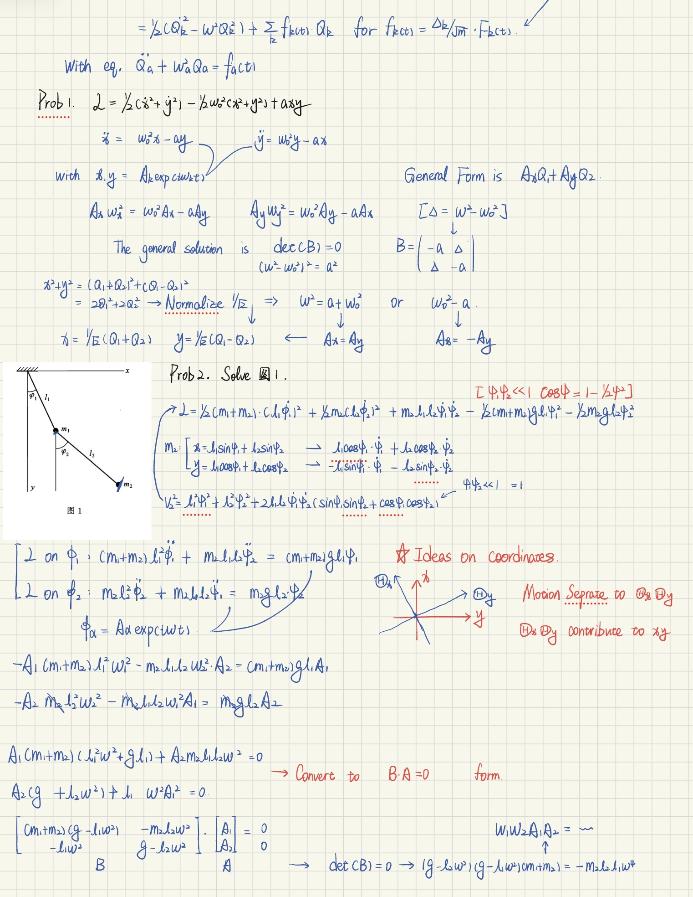
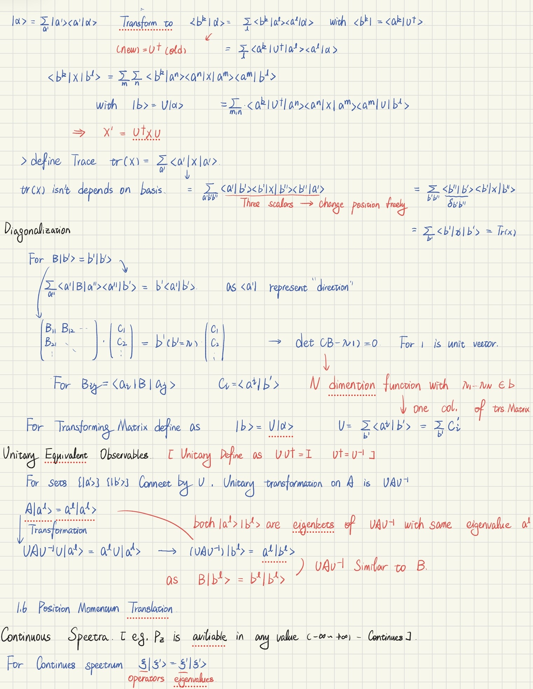
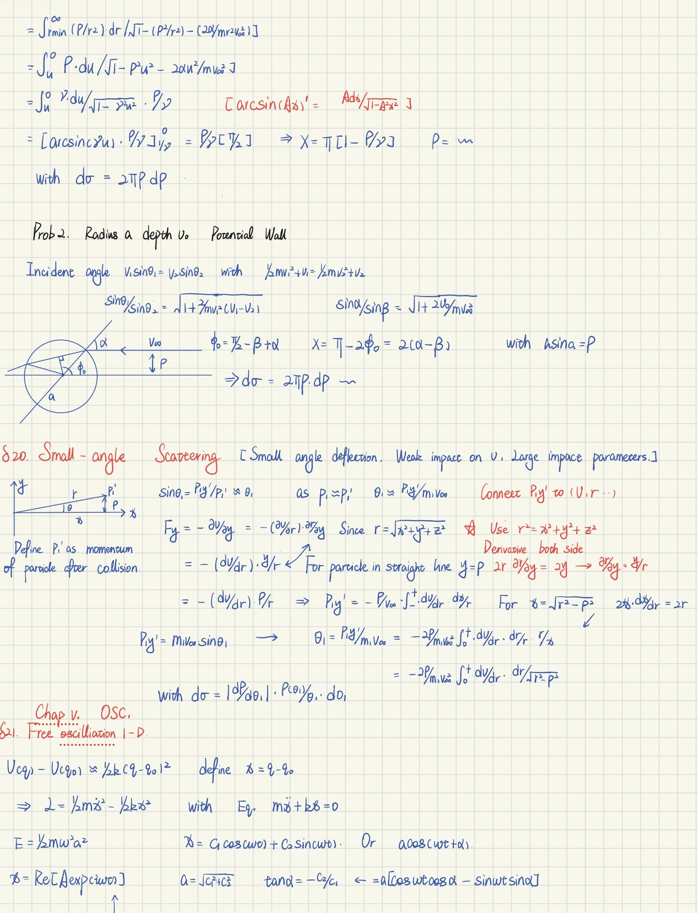
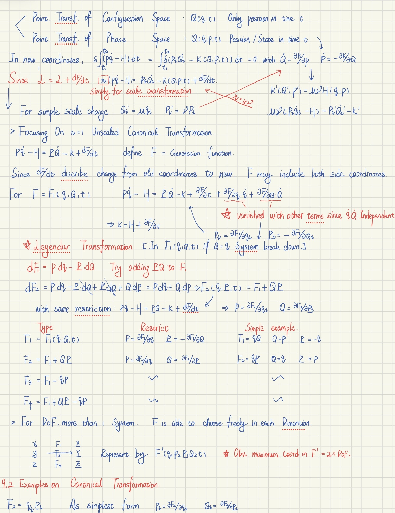

# ⚛️ Advanced Theoretical Physics Manuscripts

**Maintainer:** Chengxu (Leo) Liu 
**Focus:** Analytical Mechanics, Quantum Mechanics, and Mathematical Derivations

## 📌 Repository Overview
This repository serves as a living, digitized archive of my independent self-study manuscripts focusing on foundational, graduate-level theoretical physics texts. 

Rather than passively reading, my approach is to mathematically reconstruct the texts from the ground up. Theoretical physics classics are notorious for leaving massive pedagogical gaps (e.g., Landau's infamous "it is easy to see"). The primary value of these manuscripts lies in unpacking those condensed leaps of logic into complete, rigorous, step-by-step derivations.

## 📝 Features of the Manuscripts
* **Strictly Handwritten & Digitized:** I maintain high standards for penmanship and structural layout to ensure complex tensor and operator mathematics are highly readable.
* **Zero "Skipped" Steps:** Fleshing out the implicit mathematical transitions, unstated assumptions, and intermediate proofs that the original authors omitted for brevity.
* **Logical Traceability:** Every equation is treated as a theorem to be proven, ensuring absolute logical continuity.

## 👁️ Glimpse into the Manuscripts

To illustrate the standard of rigor, mathematical continuity, and visual clarity maintained throughout this repository, below are selected excerpts from my recent handwritten derivations. 

These snippets highlight my approach to unpacking complex mathematical transitions, from Lagrangian formulations and scattering cross-sections to Hamiltonian phase space and Quantum state vectors.

<table>
  <tr>
    <td align="center"><b>Landau: Analytical Mechanics</b> (Lagrangian Formulation & Coupled Oscillators)</td>
    <td align="center"><b>Sakurai & Goldstein: Quantum & Classical Mechanics</b> (Unitary Transformations & Dirac Notation)</td>
  </tr>
  <tr>
    <td></td>
    <td></td>
  </tr>
  <tr>
    <td align="center"><b>Landau: Analytical Mechanics</b> (Small-Angle Scattering Integrals)</td>
    <td align="center"><b>Goldstein: Classical Mechanics</b> (Legendre Transforms & Canonical Trans.)</td>
  </tr>
  <tr>
    <td></td>
    <td></td>
  </tr>
</table>

## 🚀 Current Trajectory & Progress

I am currently navigating through the following foundational texts. The pacing is dictated by depth of understanding rather than reading speed.

### 1. L.D. Landau & E.M. Lifshitz: *Mechanics* (Course of Theoretical Physics, Vol. 1)
* **Status:** ~50% Completed.
* **Focus:** Deep dive into the principle of least action, conservation laws derived from space-time symmetries, and the rigorous integration of equations of motion.

### 2. J.J. Sakurai: *Modern Quantum Mechanics*
* **Status:** Chapter 2 (Fundamental Concepts)
* **Context:** Currently working through the Dirac bra-ket formalism, measurement theory, and observables. 

### 3. H. Goldstein: *Classical Mechanics* (The "Side-Quest")
* **Status:** Deep-diving into **Chapter 9** (Canonical Transformations & Hamilton-Jacobi Theory).
* **Context:** While studying Sakurai's Chapter 1, I encountered deep reliance on the classical Hamiltonian formalism and Poisson brackets as the foundation for quantum commutators. To ensure my foundation is absolutely bulletproof, I have temporarily paused Sakurai to master the classical analogs in Goldstein before proceeding further into Quantum Mechanics.

## 📂 Structure (Upcoming)
*(PDF scans of my handwritten derivations will be progressively uploaded and categorized by textbook and chapter).*

* `/Landau_Mechanics_Vol1`
* `/Sakurai_Modern_QM`
* `/Goldstein_Classical_Mechanics`
